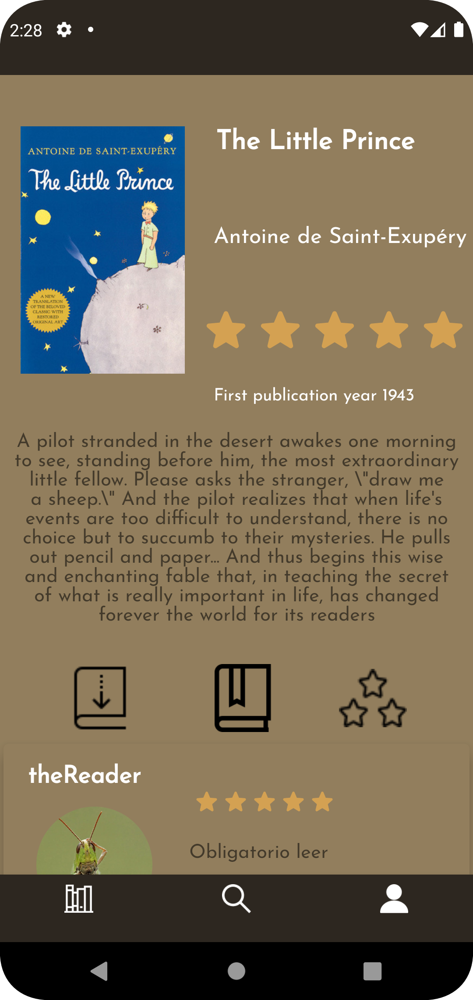

# Shelfie

## Contents

*   [Description](#description)
*   [Authors](#authors)
*   [Installing](#installing)
*   [Tutorial](#tutorial)
    * [Register or Login](#-create-your-account-or-login)
    * [Your profile](#-your-profile)
    * [Search a book](#-search-a-book)
        * [By Name or Author](#search-by-title-or-author)
        * [By Genre](#search-by-genre)
    * [Borrow the book](#-borrow-the-book)
    * [Review it](#-review-the-book)
*   [If you don't return the book in time](#-if-you-dont-return-the-book-in-time)
*   [License](#-license)

## Description

Shelfie is consists in an online book lending system. It is like a library but on your cell phone.

## Authors

[Ivan Martinez Cañero](https://gitlab.com/ivan.martinez.7e6)

[Nikita Barbosa Allidi](https://gitlab.com/nikys)

## Installing

Use git to clone this repository into your computer.

> git clone https://gitlab.com/ivan.martinez.7e6/shelfie

> git clone https://gitlab.com/ivan.martinez.7e6/shelfie-android

## Tutorial

Follow these instructions to create your profile and borrow your first book.

### Create your account or login
---

First you need to create an account or login if you have already one.
The system will ask you for an username and a password, if that username is not taken you will proceed and complete your profile. 

If you already have an account then you can log in with your username and password.

### Your profile
---

When you are logged in, you can see your profile. Here you can see your book history (the books you've read), the reviews you made and your loaned books.

Also you can edit your profile or logout from here.

### Search a book
---

The main characters of this application are books so you can filter or explore our shelf to find your book or discover new ones.

#### Search by Title or Author

You can use the searchbar to search a book by title or by author. If the database has books with that title or author it will show you those books.

#### Search by Genre

If you don't know which book are you looking but you know what genre do you want to read or do you want to try, you can search by genre so the app will show you the shelf and the books of that genre.

### Borrow the book
---

When you found your book, click on it and will take you to the detail page.
On that page you can read the synopsis, see the rating of the book and the reviews other users made.
Also here's where you can review, mark as read or borrow the book.

If you decide to borrow it, the system will lend you the book for 30 days (you can request more from the Active Loans tab in your profile).
You can only have **3** books with an active loan.

### Review the book
---

When you are done reading your book, you can review it and return it. You can do so from your active loans tab in your profile.
If you return it and don't review it, you can review it later on the detail page of the book.

And if you've already reviewed the book, you can edit your review whenever you want.

### If you don't return the book in time
---

The system will "ban" you for a week. While banned you won't be able to borrow a book or make reviews but you can still use the app. 

### License
---

This project is licensed under the [GNU Affero General Public License v3.0](https://choosealicense.com/licenses/agpl-3.0/) 

See the [LICENSE.md](LICENSE) file for details

